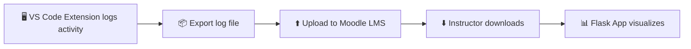

# IA690_RishiChendrayan_Capstone

A unified toolkit that combines a custom **VS Code extension** and a **Flask backend** to track, analyze, and visualize coding activity for educational or research purposes.

---

## 🚀 Project Overview

This capstone project provides an end-to-end workflow for logging, storing, and visualizing coding activity:

- **Flask Backend**: Captures, stores, and serves coding activity and diffs.
- **VS Code Extension**: Monitors and logs code edits directly from the editor, integrating with the backend for live analytics.



---

## ✨ Features

- Real-time tracking of file edits and code diffs
- Intuitive web dashboard for viewing activity by file, folder, and user
- Custom VS Code extension for seamless integration
- Modular design for easy customization or extension

---

## 📁 Folder Structure

```
IA690_RishiChendrayan_Capstone/
├── .gitignore
├── README.md
├── flask-backend/
│   ├── app.py
│   └── templates/
│       ├── diff_view.html
│       ├── file_view.html
│       ├── folder_view.html
│       └── index.html
├── vscode-extension/
│   ├── extension.js
│   ├── package.json
│   └── media/
│       └── icon.svg
```

- **flask-backend/**: Flask app source code and HTML templates for the web UI
- **vscode-extension/**: All VS Code extension source files

---

## ⚙️ Getting Started

### Prerequisites

- **Flask Backend:**  
  - Python 3.8+  
  - `pip` for dependency management

- **VS Code Extension:**  
  - [Node.js](https://nodejs.org/) (for packaging if modifying the extension)
  - [VS Code](https://code.visualstudio.com/)
  - [VSCE](https://code.visualstudio.com/api/working-with-extensions/publishing-extension) (for packaging, optional)

---

### 1. Clone the Repository

```bash
git clone https://github.com/Clarkson-Applied-Data-Science/IA690_RishiChendrayan_Capstone.git
cd IA690_RishiChendrayan_Capstone
```

---

### 2. Set Up and Run the Flask Backend

```bash
cd flask-backend
python3 -m venv venv
source venv/bin/activate  # On Windows: venv\Scriptsctivate
pip install flask
python app.py
```

The Flask app will run by default on [http://localhost:5000](http://localhost:5000).

---

### 3. Install and Run the VS Code Extension

#### If modifying/building the extension:

```bash
cd ../vscode-extension
npm install
```

#### To install the extension for local testing:

- Open the `vscode-extension` folder in VS Code.
- Press `F5` to launch an Extension Development Host.

Or, to package and install:

```bash
npm install -g vsce
vsce package
# This creates a .vsix file. In VS Code, press Ctrl+Shift+P, select 'Install from VSIX...' and choose the file.
```

---

## 🖥️ Usage

1. **Start the Flask backend.**  
2. **Install and activate the VS Code extension.**  
3. Edit code as usual in VS Code. The extension logs activity, which you can view in the Flask web dashboard.

- Access the dashboard at [http://localhost:5000](http://localhost:5000)
- Browse activity by file, folder, or diff views

---

## 🤝 Contributing

Pull requests are welcome!  
For major changes, please open an issue first to discuss what you would like to change.

- Fork the repo
- Create your feature branch (`git checkout -b feature/YourFeature`)
- Commit your changes (`git commit -am 'Add some feature'`)
- Push to the branch (`git push origin feature/YourFeature`)
- Open a pull request

---

## 📄 License

This project is licensed under the MIT License.

---

## 🙏 Acknowledgments

- Inspired by open source logging and analytics tools
- Developed as part of IA690 Capstone at Clarkson University

---

## 📝 Notes

- For deployment, consider using environment variables for configuration (`.env` files).
- If you have questions or encounter issues, please [open an issue](https://github.com/Clarkson-Applied-Data-Science/IA690_RishiChendrayan_Capstone/issues).

---

*Created by Rishi Chendrayan as part of Clarkson University's Applied Data Science Capstone project.*
