# IA690_RishiChendrayan_Capstone

A unified toolkit that combines a custom **VS Code extension** and a **Flask backend** to track, analyze, and visualize coding activity for educational or research purposes.

---

## 🚀 Project Overview

This capstone project provides an end-to-end workflow for logging, storing, and visualizing coding activity:

- **Flask Backend**: Captures, stores, and serves coding activity and diffs.
- **VS Code Extension**: Monitors and logs code edits directly from the editor, integrating with the backend for live analytics.

```mermaid
flowchart LR
    A[🖥️ VS Code Extension logs activity] --> B[📦 Export log file]
    B --> C[⬆️ Upload to Moodle LMS]
    C --> D[⬇️ Instructor downloads]
    D --> E[📊 Flask App visualizes]
```


| Step | Action                                                      |
|------|-------------------------------------------------------------|
| 1    | VS Code Extension logs code activity                        |
| 2    | Student exports log file                                    |
| 3    | Student uploads log to Moodle LMS                           |
| 4    | Instructor downloads logs submitted by all students         |
| 5    | Instructor loads log in Flask app                           |

---

## ✨ Features

- Real-time tracking of file edits and code diffs
- Intuitive web dashboard for viewing activity by file, folder, and user
- Custom VS Code extension for seamless integration
- Modular design for easy customization or extension

---

## 📁 Folder Structure

```
IA690_RishiChendrayan_Capstone/
├── .gitignore
├── README.md
├── flask-backend/
│   ├── app.py
│   └── templates/
│       ├── diff_view.html
│       ├── file_view.html
│       ├── folder_view.html
│       └── index.html
├── vscode-extension/
│   ├── extension.js
│   ├── package.json
│   └── media/
│       └── icon.svg
```

- **flask-backend/**: Flask app source code and HTML templates for the web UI
- **vscode-extension/**: All VS Code extension source files

---

## 🧩 Component Details

### 1. VS Code Extension (Code Logging & Export)

**What it does:**  
Monitors coding activity (files edited, changes made) in VS Code. Allows you to export a log file for submission.

**Dependencies:**  
- [Node.js](https://nodejs.org/) (required)
- [npm](https://www.npmjs.com/) (Node package manager)
- [VS Code](https://code.visualstudio.com/) (for running/testing)
- [vsce](https://code.visualstudio.com/api/working-with-extensions/publishing-extension) (optional, for packaging)

#### Setup

```bash
cd vscode-extension
npm install
```

- **Run in development:** open folder in VS Code, press `F5`
- **Package extension:** `npm install -g vsce && vsce package`
- **Install extension:**  
  In VS Code: `Ctrl+Shift+P` → “Install from VSIX” → select your package

- **Export log file:**  
  Use the export feature in the extension (see the command palette or documentation).

---

### 2. Flask Data Visualization App

**What it does:**  
Loads and visualizes submitted log files for instructor analysis (view edits, diffs, activity over time).

**Dependencies:**  
- Python 3.8+
- [Flask](https://flask.palletsprojects.com/)
- `pip` (Python package manager)
- (Recommended: `venv` for virtual environment)

#### Setup

```bash
cd flask-backend
python3 -m venv venv
source venv/bin/activate      # On Windows: venv\Scriptsctivate
pip install flask
python app.py
```

App runs at: [http://localhost:5000](http://localhost:5000)

- **Load log file:**  
  Use the app's upload feature in the dashboard.

---

## 🖥️ Usage

- **Start the Flask backend**
- **Install and activate the VS Code extension**
- Edit code in VS Code (extension logs activity)
- Export log file and submit via Moodle
- Instructor downloads and loads log file into Flask app dashboard

---

## 🤝 Contributing

Pull requests are welcome!  
For major changes, please open an issue first to discuss what you would like to change.

- Fork the repo
- Create your feature branch (`git checkout -b feature/YourFeature`)
- Commit your changes (`git commit -am 'Add some feature'`)
- Push to the branch (`git push origin feature/YourFeature`)
- Open a pull request

---

## 📄 License

This project is licensed under the MIT License.

---

## 🙏 Acknowledgments

- Inspired by open source logging and analytics tools
- Developed as part of IA690 Capstone at Clarkson University

---

## 📝 Notes

- For deployment, consider using environment variables for configuration (`.env` files).
- If you have questions or encounter issues, please [open an issue](https://github.com/Clarkson-Applied-Data-Science/IA690_RishiChendrayan_Capstone/issues).

---

*Created by Rishi Chendrayan as part of Clarkson University's Applied Data Science Capstone project.*
